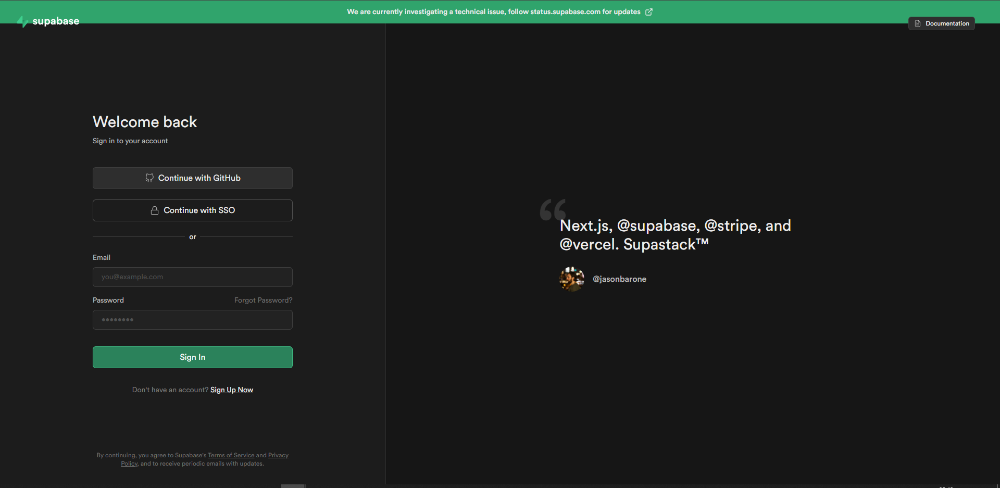
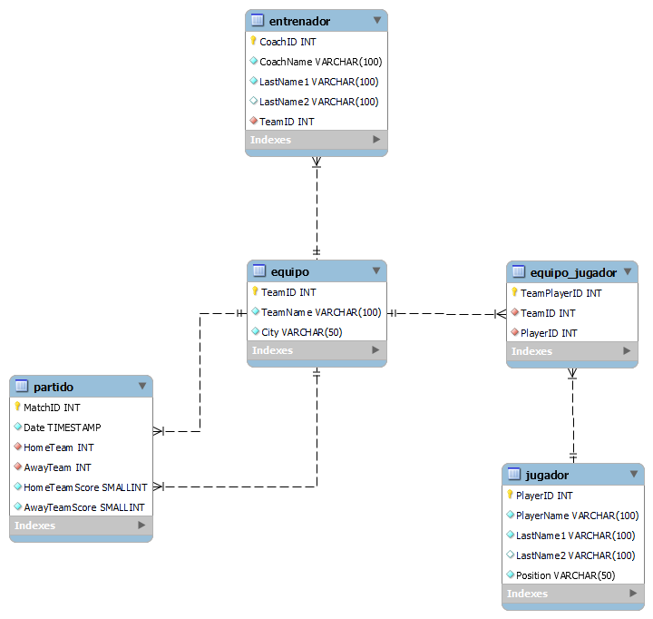

# Caso práctico "Fundamentos de bases de datos y SQL"

## Índice
- [Previo](#previo)
1. [Creación de una base de datos](#1-creación-de-la-base-de-datos)
2. [Creación de las tablas](#2-creación-de-las-tablas)
	1. [Tabla *"equipo"*.](#1-tabla-equipo)
	2. [Tabla *"entrenador"*.](#2-tabla-entrenador)
	3. [Tabla *"jugador"*.](#3-tabla-jugador)
	4. [Tabla *"equipo_jugador"*.](#4-tabla-equipo_jugador)
	5. [Tabla *"partido"*.](#5-tabla-partido)
3. [Inserción de registros](#3-inserción-de-registros)
	1. [Tabla *"equipo"*.](#1-tabla-equipo-1)
	2. [Tabla *"entrenador"*.](#2-tabla-entrenador-1)
	3. [Tabla *"jugador"*.](#3-tabla-jugador-1)
	4. [Tabla *"equipo_jugador"*.](#4-tabla-equipo_jugador-1)
	5. [Tabla *"partido"*.](#5-tabla-partido-1)
4. [Pruebas en tablas](#4-pruebas-en-tablas)
5. [Script completo (*"creación de tablas e inserción de registros"*)](#5-script)
6. [Actualización de registros](#6-actualización-de-registros)
	1. [Actualización de la tabla *"partido"*.](#1-actualización-de-la-tabla-partido)
7. [Eliminación de registros](#7-eliminación-de-registros)
8. [Consultas en las tablas.](#8-consultas-en-las-tablas)
	1. [Tabla "*partidos*".](#1-tabla-partidos)
	2. [Segunda mitad de equipos registrados.](#2-segunda-mitad-de-equipos-registrados)
	3. [Cantidad de equipos con y sin entrenador.](#3-cantidad-de-equipos-con-y-sin-entrenador)
	4. [Equipos que tienen o no entrenador.](#4-equipos-que-tienen-o-no-entrenador)
	5. [Partidos jugados a las 2 de la tarde en punto.](#5-partidos-jugados-a-las-2-de-la-tarde-en-punto)
	6. [Jugadores que tengan el nombre “José"](#6-jugadores-que-tengan-el-nombre-josé)
	7. [Top ten de los partidos con más goles.](#7-top-ten-de-los-partidos-con-más-goles)
	8. [*"Derbies"* de partidos.](#8-derbies-de-partidos)
	9. [Tabla general de la temporada.](#9-tabla-general-de-la-temporada)
9. [Script completo (*"consultas en las tablas"*)](#9-script)
## Previo:
### El sistema gestor de bases de datos relacionales a utilizar es **PostgreSQL** 
### 1. Servicio a utlizar:

Es posible utilizar PostgreSQL sin tener que realizar la instalación de un servidor y cliente gracias a ***Supabase***. 

[Supabase](https://supabase.com/) es un servicio en la nube que permite utilizar bases de datos relacionales.

### 2. Cree una cuenta en Supabase.
#### Acceda al servicio en el siguiente [enlace](https://supabase.com/), después cree una cuenta, puede utilizar su cuenta de GitHub.


### 3. Creación de un proyecto

Una vez con una cuenta creada puede crear su primer proyecto para poder trabajar con el editor de SQL.

## 1. Creación de la base de datos:
### Si se está utilizando el servicio de Supabase por defecto crea una base de datos, por lo que se puede saltar este paso. Caso contrario, cree una base de datos de nombre "futbol":

```sql
DROP DATABASE IF EXISTS futbol;
CREATE DATABASE IF NOT EXISTS futbol;
```

## 2. Creación de las tablas:
### Una vez creada la base de datos, de acuerdo con el siguiente diagrama "*Entididad - Relación*" cree las tablas:



### **Elimine las tablas**: Para evitar problemas de consistencia e integridad de la información con los datos almacenados y sus relaciones mediante las llaves foráneas, para fines prácticos se van a eliminar las tablas para después crearlas:

```sql
DROP TABLE IF EXISTS entrenador;
DROP TABLE IF EXISTS equipo_jugador;
DROP TABLE IF EXISTS partido;
DROP TABLE IF EXISTS equipo;
DROP TABLE IF EXISTS jugador;
```

### 1. Tabla "***equipo***":
```sql
CREATE TABLE IF NOT EXISTS equipo (
	TeamID SERIAL PRIMARY KEY,
    TeamName VARCHAR(100) NOT NULL,
    City VARCHAR(50) NOT NULL
);
```

### 2. Tabla "***entrenador***":
```sql
CREATE TABLE IF NOT EXISTS entrenador (
	CoachID SERIAL PRIMARY KEY,
    CoachName VARCHAR(100) NOT NULL,
	LastName1 VARCHAR(100) NOT NULL,
	LastName2 VARCHAR(100) NULL,
	TeamID INTEGER REFERENCES equipo(TeamID) ON DELETE CASCADE ON UPDATE CASCADE
);
```

### 3. Tabla "***jugador***":
```sql
CREATE TABLE IF NOT EXISTS jugador (
	PlayerID SERIAL PRIMARY KEY,
    PlayerName VARCHAR(100) NOT NULL,
	LastName1 VARCHAR(100) NOT NULL,
	LastName2 VARCHAR(100) NULL,
    Position VARCHAR(50) NOT NULL
);
```

### 4. Tabla "***equipo_jugador***":
```sql
CREATE TABLE IF NOT EXISTS equipo_jugador (
	TeamPlayerID SERIAL PRIMARY KEY,
	TeamID INTEGER NOT NULL,
	PlayerID INTEGER NOT NULL
);

ALTER TABLE IF EXISTS equipo_jugador ADD FOREIGN KEY (TeamID) REFERENCES equipo(TeamID) ON DELETE CASCADE ON UPDATE CASCADE,
ADD FOREIGN KEY (PlayerID) REFERENCES jugador(PlayerID) ON DELETE CASCADE ON UPDATE CASCADE;
```

### 5. Tabla "***partido***":
```sql
CREATE TABLE IF NOT EXISTS partido (
	MatchID SERIAL PRIMARY KEY,
    Date DATE NOT NULL,
	HomeTeam INTEGER REFERENCES equipo(TeamID) ON DELETE CASCADE ON UPDATE CASCADE NOT NULL,
	AwayTeam INTEGER REFERENCES equipo(TeamID) ON DELETE CASCADE ON UPDATE CASCADE NOT NULL,
	HomeTeamScore SMALLINT NOT NULL,
	AwayTeamScore SMALLINT NOT NULL
);
```


## 3. Inserción de registros:

Una vez creadas las tablas, se crean los registros de prueba para cada tabla. Ingrese el siguiente código:

### 1. Tabla "***equipo***":
```sql
INSERT INTO equipo (teamname, city) 
	VALUES 
		('Real Madrid C.F',	'Madrid'),
		('F.C Barcelona', 'Barcelona'),
		('Atlético de Madrid', 'Madrid'),
		('Real Sociedad', 'San Sebastían'),
		('Villarreal C.F', 'Villarreal'),
		('Real Betis Balompié', 'Sevilla'),
		('Athletic Club Athletic', 'Villa de Bilbao'),
		('Valencia C.F', 'Valencia'),
		('Sevilla F.C'	, 'Sevilla'),
		('R.C Celta de Vigo', 'Vigo'),
		('Getafe C.F', 'Madrid'),
		('C.A Osasuna', 'Pamplona'),
		('Girona F.C', 'Gerona'),
		('Rayo Vallecano', 'Madrid'),
		('R.C.D Espanyol', 'Barcelona'),
		('R.C.D Mallorca', 'Mallorca'),
		('U.D Almería', 'Almería'),
		('Real Valladolid C.F', 'Valladolid'),
		('Cádiz C.F', 'Cádiz'),
		('Elche C.F', 'Valencia')
;
```
Una vez creada la tabla deberá verse de la siguiente forma:

| **_TeamID_** |      **_TeamName_**      |     **_City_**    |
|:------------:|:------------------------:|:-----------------:|
|      _1_     |     _Real Madrid C.F_    |      _Madrid_     |
|      _2_     |      _F.C Barcelona_     |    _Barcelona_    |
|      _3_     |   _Atlético de Madrid_   |      _Madrid_     |
|      _4_     |      _Real Sociedad_     |  _San Sebastían_  |
|      _5_     |     _Villarreal C.F_     |    _Villarreal_   |
|      _6_     |   _Real Betis Balompié_  |     _Sevilla_     |
|      _7_     | _Athletic Club Athletic_ | _Villa de Bilbao_ |
|      _8_     |      _Valencia C.F_      |     _Valencia_    |
|      _9_     |       _Sevilla F.C_      |     _Sevilla_     |
|     _10_     |    _R.C Celta de Vigo_   |       _Vigo_      |
|     _11_     |       _Getafe C.F_       |      _Madrid_     |
|     _12_     |       _C.A Osasuna_      |     _Pamplona_    |
|     _13_     |       _Girona F.C_       |      _Gerona_     |
|     _14_     |     _Rayo Vallecano_     |      _Madrid_     |
|     _15_     |     _R.C.D Espanyol_     |    _Barcelona_    |
|     _16_     |     _R.C.D Mallorca_     |     _Mallorca_    |
|     _17_     |       _U.D Almería_      |     _Almería_     |
|     _18_     |   _Real Valladolid C.F_  |    _Valladolid_   |
|     _19_     |        _Cádiz C.F_       |      _Cádiz_      |
|     _20_     |        _Elche C.F_       |     _Valencia_    |


### 2. Tabla "***entrenador***":
```sql
INSERT INTO entrenador (CoachName, LastName1, LastName2, TeamID) 
  VALUES 
    ('Carlo', 'Ancelotti', '', 1),
    ('Xavi', 'Hernández', 'Creus', 2),
    ('Diego Pablo', 'Simeone', '', 3),
    ('Imanol', 'Alguacil', 'Barrenetxea', 4),
    ('Enrique', 'Setién', 'Solar', 5),
    ('Manuel Luis', 'Pellegrini', 'Ripamonti', 6),
    ('Ernesto', 'Valverde', 'Tejedor', 7),
    ('Javier', 'Aguirre', 'Onaindía', 16)
;
```
Una vez creada la tabla deberá verse de la siguiente forma:
| **_CoachID_** | **_CoachName_** | **LastName1** | **_LastName2_** | **_TeamID_** |
|:----------:|:---------------:|:-------------:|:---------------:|:------------:|
|      1     |     _Carlo_     |  _Ancelotti_  |                 |      _1_     |
|      2     |      _Xavi_     |  _Hernández_  |     _Creus_     |      _2_     |
|      3     |  _Diego Pablo_  |   _Simeone_   |                 |      _3_     |
|      4     |     _Imanol_    |   _Alguacil_  |  _Barrenetxea_  |      _4_     |
|      5     |    _Enrique_    |    _Setién_   |     _Solar_     |      _5_     |
|      6     |  _Manuel Luis_  |  _Pellegrini_ |   _Ripamonti_   |      _6_     |
|      7     |    _Ernesto_    |   _Valverde_  |    _Tejedor_    |      _7_     |
|      8     |     _Javier_    |   _Aguirre_   |    _Onaindía_   |     _16_     |

### 3. Tabla "***jugador***":
```sql
INSERT INTO jugador (PlayerName, LastName1, LastName2, Position) 
  VALUES
    ('Thibaut Nicolas', 'Marc', 'Courtois', 'portero'),
    ('Éder Gabriel', 'Militão', '', 'defensa'),
    ('David ', 'Olatukunbo', 'Alaba', 'defensa'),
    ('Ferland ', 'Sinna', 'Mendy', 'defensa'),
    ('Lucas', 'Vázquez', 'Iglesias', 'defensa'),
    ('Toni', 'Kroos', '', 'mediocampista'),
    ('Luka ', 'Modrić', '', 'mediocampista'),
    ('Federico Santiago', 'Valverde', 'Dipetta', 'mediocampista'),
    ('Vinicius José', 'Paixão', 'de Oliveira Junior', 'delantero'),
    ('Rodrygo', 'Silva', 'de Goes', 'delantero'),
    ('Karim', 'Benzema', '', 'delantero'),
    ('Aurélien', 'Djani', 'Tchouaméni', 'mediocampista'),

    ('Marc-André', 'ter Stegen', '', 'portero'),
    ('Ronald Federico', 'Araújo', 'da Silva', 'defensa'),
    ('Alejandro', 'Balde', 'Martínez', 'defensa'),
    ('Jules Olivier', 'Kounde', '', 'defensa'),
    ('Jordi', 'Alba', 'Ramos', 'defensa'),
    ('Pedro', 'González', 'López', 'mediocampista'),
    ('Pablo Martín', 'Páez', 'Gavira', 'mediocampista'),
    ('Frenkie', 'de Jong', '', 'mediocampista'),
    ('Masour', 'Ousmane', 'Dembélé', 'delantero'),
    ('Raphael', 'Dias', 'Belloli', 'delantero'),
    ('Robert', 'Lewandowski', '', 'delantero'),
    ('Anssumane', 'Fati', 'Vieira', 'delantero'),

    ('Nahuel', 'Molina', 'Lucero', 'defensa'), --ATLETICO DE MADRID
    ('Antoine', 'Griezmann', '', 'delantero'),
    ('Memphis ', 'Depay', '', 'delantero'),
    ('Alex Nicolao', 'Telles', '', 'defensa'), -- SEVILLA
    ('Jesús Manuel', 'Corona', 'Ruíz', 'delantero'),
    ('Guido', 'Rodríguez', '', 'mediocampista'), -- REAL BETIS
    ('José Andrés', 'Guardado', 'Hernández', 'mediocampista'),
    ('Claudio Andrés', 'Bravo', 'Muñoz', 'portero'),
    ('Nabil', 'Fekir', '', 'mediocampista'),
    ('César Jasib', 'Montes', 'Castro', 'defensa'), -- Espanyol 
    ('Denis', 'Suárez', 'Fernández', 'mediocampista'),
    ('Martin', 'Christensen', 'Braithwaite', 'delantero')   
;
```

Una vez creada la tabla deberá verse de la siguiente forma:
| **_PlayerID_** |   **_PlayerName_**  | **_LastName1_** |    **_LastName2_**   |  **_Position_** |
|:--------------:|:-------------------:|:---------------:|:--------------------:|:---------------:|
|       _1_      |  _Thibaut Nicolas_  |      _Marc_     |      _Courtois_      |    _portero_    |
|       _2_      |    _Éder Gabriel_   |    _Militão_    |                      |    _defensa_    |
|       _3_      |       _David_       |   _Olatukunbo_  |        _Alaba_       |    _defensa_    |
|       _4_      |      _Ferland_      |     _Sinna_     |        _Mendy_       |    _defensa_    |
|       _5_      |       _Lucas_       |    _Vázquez_    |      _Iglesias_      |    _defensa_    |
|       _6_      |        _Toni_       |     _Kroos_     |                      | _mediocampista_ |
|       _7_      |        _Luka_       |     _Modrić_    |                      | _mediocampista_ |
|       _8_      | _Federico Santiago_ |    _Valverde_   |       _Dipetta_      | _mediocampista_ |
|       _9_      |   _Vinicius José_   |     _Paixão_    | _de Oliveira Junior_ |   _delantero_   |
|      _10_      |      _Rodrygo_      |     _Silva_     |       _de Goes_      |   _delantero_   |
|      _11_      |       _Karim_       |    _Benzema_    |                      |   _delantero_   |
|      _12_      |      _Aurélien_     |     _Djani_     |     _Tchouaméni_     | _mediocampista_ |
|      _13_      |     _Marc-André_    |   _ter Stegen_  |                      |    _portero_    |
|      _14_      |  _Ronald Federico_  |     _Araújo_    |      _da Silva_      |    _defensa_    |
|      _15_      |     _Alejandro_     |     _Balde_     |      _Martínez_      |    _defensa_    |
|      _16_      |   _Jules Olivier_   |     _Kounde_    |                      |    _defensa_    |
|      _17_      |       _Jordi_       |      _Alba_     |        _Ramos_       |    _defensa_    |
|      _18_      |       _Pedro_       |    _González_   |        _López_       | _mediocampista_ |
|      _19_      |    _Pablo Martín_   |      _Páez_     |       _Gavira_       | _mediocampista_ |
|      _20_      |      _Frenkie_      |    _de Jong_    |                      | _mediocampista_ |
|      _21_      |       _Masour_      |    _Ousmane_    |       _Dembélé_      |   _delantero_   |
|      _22_      |      _Raphael_      |      _Dias_     |       _Belloli_      |   _delantero_   |
|      _23_      |       _Robert_      |  _Lewandowski_  |                      |   _delantero_   |
|      _24_      |     _Anssumane_     |      _Fati_     |       _Vieira_       |   _delantero_   |
|      _25_      |       _Nahuel_      |     _Molina_    |       _Lucero_       |    _defensa_    |
|      _26_      |      _Antoine_      |   _Griezmann_   |                      |   _delantero_   |
|      _27_      |      _Memphis_      |     _Depay_     |                      |   _delantero_   |
|      _28_      |    _Alex Nicolao_   |     _Telles_    |                      |    _defensa_    |
|      _29_      |    _Jesús Manuel_   |     _Corona_    |        _Ruíz_        |   _delantero_   |
|      _30_      |       _Guido_       |   _Rodríguez_   |                      | _mediocampista_ |
|      _31_      |    _José Andrés_    |    _Guardado_   |      _Hernández_     | _mediocampista_ |
|      _32_      |   _Claudio Andrés_  |     _Bravo_     |        _Muñoz_       |    _portero_    |
|      _33_      |       _Nabil_       |     _Fekir_     |                      | _mediocampista_ |
|      _34_      |    _César Jasib_    |     _Montes_    |       _Castro_       |    _defensa_    |
|      _35_      |       _Denis_       |     _Suárez_    |      _Fernández_     | _mediocampista_ |
|      _36_      |       _Martin_      |  _Christensen_  |     _Braithwaite_    |   _delantero_   |


### 4. Tabla "***equipo_jugador***":
La tabla genera una especie de "*catálogo*" a partir del ingreso de llaves foráneas, por ello solo hay números:
```sql
INSERT INTO equipo_jugador (TeamID, PlayerID)
  VALUES
    (1, 1),
    (1, 2),
    (1, 3),
    (1, 4),
    (1, 5),
    (1, 6),
    (1, 7),
    (1, 8),
    (1, 9),
    (1, 10),
    (1, 11),
    (1, 12),

    (2, 13),
    (2, 14),
    (2, 15),
    (2, 16),
    (2, 17),
    (2, 18),
    (2, 19),
    (2, 20),
    (2, 21),
    (2, 22),
    (2, 23),
    (2, 24),

    (3, 25),
    (3, 26),
    (3, 27),

    (9, 28),
    (9, 29),
    
    (6, 30),
    (6, 31),
    (6, 32),
    (6, 33),

    (15, 34),
    (15, 35),
    (15, 36)
;
```
Una vez creada la tabla deberá verse de la siguiente forma:
| **_TeamPlayerID_** | **_TeamID_** | **_PlayerID_** |
|:------------------:|:------------:|:--------------:|
|         _1_        |      _1_     |       _1_      |
|         _2_        |      _1_     |       _2_      |
|         _3_        |      _1_     |       _3_      |
|         _4_        |      _1_     |       _4_      |
|         _5_        |      _1_     |       _5_      |
|         _6_        |      _1_     |       _6_      |
|         _7_        |      _1_     |       _7_      |
|         _8_        |      _1_     |       _8_      |
|         _9_        |      _1_     |       _9_      |
|        _10_        |      _1_     |      _10_      |
|        _11_        |      _1_     |      _11_      |
|        _12_        |      _1_     |      _12_      |
|        _13_        |      _2_     |      _13_      |
|        _14_        |      _2_     |      _14_      |
|        _15_        |      _2_     |      _15_      |
|        _16_        |      _2_     |      _16_      |
|        _17_        |      _2_     |      _17_      |
|        _18_        |      _2_     |      _18_      |
|        _19_        |      _2_     |      _19_      |
|        _20_        |      _2_     |      _20_      |
|        _21_        |      _2_     |      _21_      |
|        _22_        |      _2_     |      _22_      |
|        _23_        |      _2_     |      _23_      |
|        _24_        |      _2_     |      _24_      |
|        _25_        |      _3_     |      _25_      |
|        _26_        |      _3_     |      _26_      |
|        _27_        |      _3_     |      _27_      |
|        _28_        |      _9_     |      _28_      |
|        _29_        |      _9_     |      _29_      |
|        _30_        |      _6_     |      _30_      |
|        _31_        |      _6_     |      _31_      |
|        _32_        |      _6_     |      _32_      |
|        _33_        |      _6_     |      _33_      |
|        _34_        |     _15_     |      _34_      |
|        _35_        |     _15_     |      _35_      |
|        _36_        |     _15_     |      _36_      |

### 5. Tabla "***partido***":
Esta tabla también contiene llaves foráneas:
```sql
INSERT INTO partido (Date, HomeTeam, AwayTeam, HomeTeamScore, AwayTeamScore) 
  VALUES
    ('2022-10-07 14:00:00', 12, 8, 1, 2),
    ('2022-10-08 07:00:00', 17, 14, 3, 1),
    ('2022-10-08 09:15:00', 3, 13, 2, 1),
    ('2022-10-08 11:30:00', 9, 7, 1, 1),
    ('2022-10-08 14:00:00', 11, 1, 0, 1),
    ('2022-10-09 07:00:00', 18, 6, 0, 0),
    ('2022-10-09 09:15:00', 19, 15, 2, 2),
    ('2022-10-09 11:30:00', 4, 5, 1, 0),
    ('2022-10-09 14:00:00', 2, 10, 1, 0),
    ('2022-10-10 14:30:00', 20, 16, 1, 1),

    ('2022-10-14 14:00:00', 14, 11, 0, 0),
    ('2022-10-15 07:00:00', 13, 19, 1, 1),
    ('2022-10-15 09:15:00', 8, 20, 2, 2),
    ('2022-10-15 11:30:00', 16, 9, 0, 1),
    ('2022-10-15 14:00:00', 7, 3, 0, 1),
    ('2022-10-16 07:00:00', 10, 4, 1, 2),
    ('2022-10-16 09:15:00', 1, 2, 3, 1),
    ('2022-10-16 11:30:00', 15, 18, 1, 0),
    ('2022-10-16 14:00:00', 6, 17, 3, 1),
    ('2022-10-17 14:00:00', 5, 12, 2, 0),

    ('2023-06-04 10:30:00', 16, 14, 3, 0),
    ('2023-06-04 10:30:00', 12, 13, 2, 1),
    ('2023-06-04 10:30:00', 1, 7, 1, 1),
    ('2023-06-04 10:30:00', 4, 9, 2, 1),
    ('2023-06-04 10:30:00', 5, 3, 2, 2),
    ('2023-06-04 10:30:00', 10, 2, 2, 1),
    ('2023-06-04 10:30:00', 20, 19, 1, 1),
    ('2023-06-04 10:30:00', 15, 17, 3, 3),
    ('2023-06-04 10:30:00', 6, 8, 1, 1),
    ('2023-06-04 10:30:00', 18, 11, 0, 0)
;
```

Una vez creada la tabla deberá verse de la siguiente forma:

| **_MatchID_** |       **_Date_**      | **_HomeTeam_** | **_AwayTeam_** | **_HomeTeamScore_** | **_AwayTeamScore_** |
|:-------------:|:---------------------:|:--------------:|:--------------:|:-------------------:|---------------------|
|      _1_      | _2022-10-07 14:00:00_ |      _12_      |       _8_      |         _1_         |         _2_         |
|      _2_      | _2022-10-08 07:00:00_ |      _17_      |      _14_      |         _3_         |         _1_         |
|      _3_      | _2022-10-08 09:15:00_ |       _3_      |      _13_      |         _2_         |         _1_         |
|      _4_      | _2022-10-08 11:30:00_ |       _9_      |       _7_      |         _1_         |         _1_         |
|      _5_      | _2022-10-08 14:00:00_ |      _11_      |       _1_      |         _0_         |         _1_         |
|      _6_      | _2022-10-09 07:00:00_ |      _18_      |       _6_      |         _0_         |         _0_         |
|      _7_      | _2022-10-09 09:15:00_ |      _19_      |      _15_      |         _2_         |         _2_         |
|      _8_      | _2022-10-09 11:30:00_ |       _4_      |       _5_      |         _1_         |         _0_         |
|      _9_      | _2022-10-09 14:00:00_ |       _2_      |      _10_      |         _1_         |         _0_         |
|      _10_     | _2022-10-10 14:30:00_ |      _20_      |      _16_      |         _1_         |         _1_         |
|      _11_     | _2022-10-14 14:00:00_ |      _14_      |      _11_      |         _0_         |         _0_         |
|      _12_     | _2022-10-15 07:00:00_ |      _13_      |      _19_      |         _1_         |         _1_         |
|      _13_     | _2022-10-15 09:15:00_ |       _8_      |      _20_      |         _2_         |         _2_         |
|      _14_     | _2022-10-15 11:30:00_ |      _16_      |       _9_      |         _0_         |         _1_         |
|      _15_     | _2022-10-15 14:00:00_ |       _7_      |       _3_      |         _0_         |         _1_         |
|      _16_     | _2022-10-16 07:00:00_ |      _10_      |       _4_      |         _1_         |         _2_         |
|      _17_     | _2022-10-16 09:15:00_ |       _1_      |       _2_      |         _3_         |         _1_         |
|      _18_     | _2022-10-16 11:30:00_ |      _15_      |      _18_      |         _1_         |         _0_         |
|      _19_     | _2022-10-16 14:00:00_ |       _6_      |      _17_      |         _3_         |         _1_         |
|      _20_     | _2022-10-17 14:00:00_ |       _5_      |      _12_      |         _2_         |         _0_         |
|      _21_     | _2023-06-04 10:30:00_ |      _16_      |      _14_      |         _3_         |         _0_         |
|      _22_     | _2023-06-04 10:30:00_ |      _12_      |      _13_      |         _2_         |         _1_         |
|      _23_     | _2023-06-04 10:30:00_ |       _1_      |       _7_      |         _1_         |         _1_         |
|      _24_     | _2023-06-04 10:30:00_ |       _4_      |       _9_      |         _2_         |         _1_         |
|      _25_     | _2023-06-04 10:30:00_ |       _5_      |       _3_      |         _2_         |         _2_         |
|      _26_     | _2023-06-04 10:30:00_ |      _10_      |       _2_      |         _2_         |         _1_         |
|      _27_     | _2023-06-04 10:30:00_ |      _20_      |      _19_      |         _1_         |         _1_         |
|      _28_     | _2023-06-04 10:30:00_ |      _15_      |      _17_      |         _3_         |         _3_         |
|      _29_     | _2023-06-04 10:30:00_ |       _6_      |       _8_      |         _1_         |         _1_         |
|      _30_     | _2023-06-04 10:30:00_ |      _18_      |      _11_      |         _0_         |         _0_         |


## 4. Pruebas en tablas:

Para aplicar una actualización o eliminado de un registro se debe ser muy cuidadoso ya que todos los registros podrían ser afectados. A continuación se muestra un código de ejemplo para una tabla de pruebas para posteriormente manipularla:

### 1. Cree una tabla:
Se muestra una tabla de pruebas en el siguiente código para poder aplicar estas prácticas:

```sql
DROP TABLE IF EXISTS pruebas;
CREATE TABLE IF NOT EXISTS pruebas (
	id SERIAL PRIMARY KEY,
	dato VARCHAR(40)
);
```
### 2. Inserción de registros:
```sql
INSERT INTO pruebas (dato) 
  VALUES
    ('HOLA'),
    ('ESTO'),
    ('ES'),
    ('UNA'),
    ('PRUEBA'),
    (':)')
;
```
## 5. Script:
El [*"script"*](src/create_insert.sql) completo referente a *"creación de tablas e inserción de registros"* puede encontrarlo en el siguiente [*"enlace"*](src/create_insert.sql).

## 6. Actualización de registros:
Al momento de efectuar una actualización de un registro se debe ser muy cuidadoso ya que todos los registros podrían ser afectados, a continucación se muestra un ejemplo, donde si no se coloca una condición toda la tabla será afectada:
```sql
UPDATE pruebas SET dato = 'Actualización de registro';
```
Y al mostrar todos los registros pasará lo siguiente: 
| **_id_** |          **_dato_**         |
|:--------:|:---------------------------:|
|    _1_   | _Actualización de registro_ |
|    _2_   | _Actualización de registro_ |
|    _3_   | _Actualización de registro_ |
|    _4_   | _Actualización de registro_ |
|    _5_   | _Actualización de registro_ |
|    _6_   | _Actualización de registro_ |

Todas las filas fueron afectadas, por lo tanto se debe establecer una condición como en el siguiente código:
```sql
UPDATE pruebas SET dato = 'Actualizando de nuevo' WHERE id = 1;
```
Y entregará el siguiente resultado:
| **_id_** |          **_dato_**         |
|:--------:|:---------------------------:|
|    _1_   |   _Actualizando de nuevo_  |
|    _2_   | _Actualización de registro_ |
|    _3_   | _Actualización de registro_ |
|    _4_   | _Actualización de registro_ |
|    _5_   | _Actualización de registro_ |
|    _6_   | _Actualización de registro_ |
Y ahora solo fue actualizada la fila con ID igual a 1.

### 1. Actualización de la tabla *"partido"*.
Actualice la tabla partido, el campo marcador del equipo local sea igual 2 donde la hora jugada haya sido igual a ***"2023-06-04 10:30:00"***, el ID del equipo local sea igual a ***"1"*** y el ID del equipo visitante sea igual a ***"7"***:
```sql
UPDATE partido SET HomeTeamScore = 2 WHERE DATE = '2023-06-04 10:30:00' AND HomeTeam = 1 AND AwayTeam = 7;
```
Al aplicar el cambio la tabla deberá verse de la siguiente forma (afectando el registro con ID igual a ***23***):
| **_MatchID_** |       **_Date_**      | **_HomeTeam_** | **_AwayTeam_** | **_HomeTeamScore_** | **_AwayTeamScore_** |
|:-------------:|:---------------------:|:--------------:|:--------------:|:-------------------:|---------------------|
|      _1_      | _2022-10-07 14:00:00_ |      _12_      |       _8_      |         _1_         |         _2_         |
|      _2_      | _2022-10-08 07:00:00_ |      _17_      |      _14_      |         _3_         |         _1_         |
|      _3_      | _2022-10-08 09:15:00_ |       _3_      |      _13_      |         _2_         |         _1_         |
|      _4_      | _2022-10-08 11:30:00_ |       _9_      |       _7_      |         _1_         |         _1_         |
|      _5_      | _2022-10-08 14:00:00_ |      _11_      |       _1_      |         _0_         |         _1_         |
|      _6_      | _2022-10-09 07:00:00_ |      _18_      |       _6_      |         _0_         |         _0_         |
|      _7_      | _2022-10-09 09:15:00_ |      _19_      |      _15_      |         _2_         |         _2_         |
|      _8_      | _2022-10-09 11:30:00_ |       _4_      |       _5_      |         _1_         |         _0_         |
|      _9_      | _2022-10-09 14:00:00_ |       _2_      |      _10_      |         _1_         |         _0_         |
|      _10_     | _2022-10-10 14:30:00_ |      _20_      |      _16_      |         _1_         |         _1_         |
|      _11_     | _2022-10-14 14:00:00_ |      _14_      |      _11_      |         _0_         |         _0_         |
|      _12_     | _2022-10-15 07:00:00_ |      _13_      |      _19_      |         _1_         |         _1_         |
|      _13_     | _2022-10-15 09:15:00_ |       _8_      |      _20_      |         _2_         |         _2_         |
|      _14_     | _2022-10-15 11:30:00_ |      _16_      |       _9_      |         _0_         |         _1_         |
|      _15_     | _2022-10-15 14:00:00_ |       _7_      |       _3_      |         _0_         |         _1_         |
|      _16_     | _2022-10-16 07:00:00_ |      _10_      |       _4_      |         _1_         |         _2_         |
|      _17_     | _2022-10-16 09:15:00_ |       _1_      |       _2_      |         _3_         |         _1_         |
|      _18_     | _2022-10-16 11:30:00_ |      _15_      |      _18_      |         _1_         |         _0_         |
|      _19_     | _2022-10-16 14:00:00_ |       _6_      |      _17_      |         _3_         |         _1_         |
|      _20_     | _2022-10-17 14:00:00_ |       _5_      |      _12_      |         _2_         |         _0_         |
|      _21_     | _2023-06-04 10:30:00_ |      _16_      |      _14_      |         _3_         |         _0_         |
|      _22_     | _2023-06-04 10:30:00_ |      _12_      |      _13_      |         _2_         |         _1_         |
|      **_23_**     | **_2023-06-04 10:30:00_** |       **_1_**      |       **_7_**      |         **_2_**         |         **_1_**         |
|      _24_     | _2023-06-04 10:30:00_ |       _4_      |       _9_      |         _2_         |         _1_         |
|      _25_     | _2023-06-04 10:30:00_ |       _5_      |       _3_      |         _2_         |         _2_         |
|      _26_     | _2023-06-04 10:30:00_ |      _10_      |       _2_      |         _2_         |         _1_         |
|      _27_     | _2023-06-04 10:30:00_ |      _20_      |      _19_      |         _1_         |         _1_         |
|      _28_     | _2023-06-04 10:30:00_ |      _15_      |      _17_      |         _3_         |         _3_         |
|      _29_     | _2023-06-04 10:30:00_ |       _6_      |       _8_      |         _1_         |         _1_         |
|      _30_     | _2023-06-04 10:30:00_ |      _18_      |      _11_      |         _0_         |         _0_         |


## 7. Eliminación de registros:
Al momento de aplicar una eliminación de un registro debe ser muy cuidadoso ya que todos los registros podrían ser afectados, a continucación se muestra un ejemplo, donde si no se coloca una condición toda la tabla será afectada:

```sql
DELETE FROM pruebas;
```
Y al mostrar todos los registros pasará lo siguiente: 
| **_id_** |          **_dato_**         |
|:--------:|:---------------------------:|

Todas las filas fueron eliminadas, por lo tanto se debe establecer una condición como en el siguiente código:
```sql
DELETE FROM pruebas WHERE id = 1;
```
Y entregará el siguiente resultado:
| **_id_** |          **_dato_**         |
|:--------:|:---------------------------:|
|    _2_   | _Actualización de registro_ |
|    _3_   | _Actualización de registro_ |
|    _4_   | _Actualización de registro_ |
|    _5_   | _Actualización de registro_ |
|    _6_   | _Actualización de registro_ |
Y ahora solo fue eliminada la fila con ID igual a 1.

## 8. Consultas en las tablas:
A continuación se muestran todos elementos de consulta repasados en el capítulo el cual se solicita qué debe hacer, el código que se podría emplear y el resultado esperado de dicha consulta, recordando que existen diferentes formas de llegar al mismo resultado, por lo que si propone una solución diferente de resolverlo podría comunicarse con los colaboradores para seguir alimentando con estos ejercicios a la comunidad. ***Recordar*** que a partir de este momento las consultas traerán solamente los ID's de cada registro en las tablas que están relacionadas, lo cual es correcto pero esto no genera valor para el usuario final, por lo tanto se necesita una forma en que esos números se conviertan en datos que sean entendibles por el usuario.

### 1. Tabla "*partidos*".
Muestra todos los partidos incluyendo los nombres de los equipos (uso de doble ***"INNER JOIN"***):
```sql
SELECT p.MatchID AS ID, p.Date AS FECHA, home.TeamName AS EQUIPO_LOCAL, away.TeamName AS EQUIPO_VISITANTE, p.HomeTeamScore AS MARCADOR_LOCAL, p.AwayTeamScore AS MARCADOR_VISITANTE
FROM partido p
JOIN equipo home ON p.HomeTeam = home.TeamID
JOIN equipo away ON p.AwayTeam = away.TeamID;
```
Resultado:
| **_id_** | **_fecha_**               | **_equipo_local_**           | **_equipo_visitante_**       | **_marcador_local_** | **_marcador_visitante_** |
| -- | ------------------- | ---------------------- | ---------------------- | -------------- | ------------------ |
| _1_  | _2022-10-07 14:00:00_ | _C.A Osasuna_            | _Valencia C.F_           | _1_              | _2_                  |
| _2_  | _2022-10-08 07:00:00_ | _U.D Almería_            | _Rayo Vallecano_         | _3_              | _1_                  |
| _3_  | _2022-10-08 09:15:00_ | _Atlético de Madrid_     | _Girona F.C_             | _2_              | _1_                  |
| _4_  | _2022-10-08 11:30:00_ | _Sevilla F.C_            | _Athletic Club Athletic_ | _1_              | _1_                  |
| _5_  | _2022-10-08 14:00:00_ | _Getafe C.F_             | _Real Madrid C.F_        | _0_              | _1_                  |
| _6_  | _2022-10-09 07:00:00_ | _Real Valladolid C.F_    | _Real Betis Balompié_    | _0_              | _0_                  |
| _7_  | _2022-10-09 09:15:00_ | _Cádiz C.F_              | _R.C.D Espanyol_         | _2_              | _2_                  |
| _8_  | _2022-10-09 11:30:00_ | _Real Sociedad_          | _Villarreal C.F_         | _1_              | _0_                  |
| _9_  | _2022-10-09 14:00:00_ | _F.C Barcelona_          | _R.C Celta de Vigo_      | _1_              | _0_                  |
| _10_ | _2022-10-10 14:30:00_ | _Elche C.F_              | _R.C.D Mallorca_         | _1_              | _1_                  |
| _11_ | _2022-10-14 14:00:00_ | _Rayo Vallecano_         | _Getafe C.F_             | _0_              | _0_                  |
| _12_ | _2022-10-15 07:00:00_ | _Girona F.C_             | _Cádiz C.F_              | _1_              | _1_                  |
| _13_ | _2022-10-15 09:15:00_ | _Valencia C.F_           | _Elche C.F_              | _2_              | _2_                  |
| _14_ | _2022-10-15 11:30:00_ | _R.C.D Mallorca_         | _Sevilla F.C_            | _0_              | _1_                  |
| _15_ | _2022-10-15 14:00:00_ | _Athletic Club Athletic_ | _Atlético de Madrid_     | _0_              | _1_                  |
| _16_ | _2022-10-16 07:00:00_ | _R.C Celta de Vigo_      | _Real Sociedad_          | _1_              | _2_                  |
| _17_ | _2022-10-16 09:15:00_ | _Real Madrid C.F_        | _F.C Barcelona_          | _3_              | _1_                  |
| _18_ | _2022-10-16 11:30:00_ | _R.C.D Espanyol_         | _Real Valladolid C.F_    | _1_              | _0_                  |
| _19_ | _2022-10-16 14:00:00_ | _Real Betis Balompié_    | _U.D Almería_            | _3_              | _1_                  |
| _20_ | _2022-10-17 14:00:00_ | _Villarreal C.F_         | _C.A Osasuna_            | _2_              | _0_                  |
| _21_ | _2023-06-04 10:30:00_ | _R.C.D Mallorca_         | _Rayo Vallecano_         | _3_              | _0_                  |
| _22_ | _2023-06-04 10:30:00_ | _C.A Osasuna_            | _Girona F.C_             | _2_              | _1_                  |
| _23_ | _2023-06-04 10:30:00_ | _Real Madrid C.F_        | _Athletic Club Athletic_ | _2_              | _1_                  |
| _24_ | _2023-06-04 10:30:00_ | _Real Sociedad_          | _Sevilla F.C_            | _2_              | _1_                  |
| _25_ | _2023-06-04 10:30:00_ | _Villarreal C.F_         | _Atlético de Madrid_     | _2_              | _2_                  |
| _26_ | _2023-06-04 10:30:00_ | _R.C Celta de Vigo_      | _F.C Barcelona_          | _2_              | _1_                  |
| _27_ | _2023-06-04 10:30:00_ | _Elche C.F_              | _Cádiz C.F_              | _1_              | _1_                  |
| _28_ | _2023-06-04 10:30:00_ | _R.C.D Espanyol_         | _U.D Almería_            | _3_              | _3_                  |
| _29_ | _2023-06-04 10:30:00_ | _Real Betis Balompié_    | _Valencia C.F_           | _1_              | _1_                  |
| _30_ | _2023-06-04 10:30:00_ | _Real Valladolid C.F_    | _Getafe C.F_             | _0_              | _0_                  |

### 2. Segunda mitad de equipos registrados.
Mostrar la segunda mitad de equipos registrados (uso de ***"COUNT"*** y ***"OFFSET"***).

```sql
SELECT * FROM equipo OFFSET ( SELECT (COUNT(*)/2) FROM equipo );
```
Resultado:
| **_TeamID_** |      **_TeamName_**      |     **_City_**    |
|:------------:|:------------------------:|:-----------------:|
|     _**11**_     |       _Getafe C.F_       |      _Madrid_     |
|     _12_     |       _C.A Osasuna_      |     _Pamplona_    |
|     _13_     |       _Girona F.C_       |      _Gerona_     |
|     _14_     |     _Rayo Vallecano_     |      _Madrid_     |
|     _15_     |     _R.C.D Espanyol_     |    _Barcelona_    |
|     _16_     |     _R.C.D Mallorca_     |     _Mallorca_    |
|     _17_     |       _U.D Almería_      |     _Almería_     |
|     _18_     |   _Real Valladolid C.F_  |    _Valladolid_   |
|     _19_     |        _Cádiz C.F_       |      _Cádiz_      |
|     _**20**_     |        _Elche C.F_       |     _Valencia_    |

### 3. Cantidad de equipos con y sin entrenador.
Mostrar la cantidad de equipos con y sin entrenador utilizando el condicional ***"CASE WHEN"***, ***"COUNT"*** y ***"LEFT JOIN"*** para aplicar teoría de conjuntos y contar lo que hay en A (tabla *"equipo"*) sin importar que no haya relación en B (tabla *"entrenador"*).
```sql
SELECT
    CASE WHEN en.CoachID IS NULL THEN 'Sin entrenador' ELSE 'Con entrenador' END AS estado_entrenador,
    COUNT(e.TeamID) AS cantidad_equipos
FROM equipo e
LEFT JOIN entrenador en ON e.TeamID = en.TeamID
GROUP BY estado_entrenador;
```
Resultado:
| **_estado_entrenador_** | **_cantidad_equipo_** |
|:-----------------------:|:---------------------:|
|     _Con entrenador_    |          _**8**_          |
|     _Sin entrenador_    |          _**12**_         |

### 4. Equipos que tienen o no entrenador.
Mostrar todos los equipos que tienen o no entrenador, incluye el nombre del equipo y su nombre y apellidos del entrenador según sea el caso.
```sql
-- Mostrar todos los equipos que tienen o no entrenador
SELECT e.*, en.*
FROM equipo e
LEFT JOIN entrenador en ON e.TeamID = en.TeamID -- La primera consulta realiza un LEFT JOIN entre las tablas "equipo" y "entrenador", seleccionando todos los registros de la tabla "equipo" y los registros correspondientes de la tabla "entrenador". Esto incluye los equipos que tienen entrenador.

UNION ALL -- combina los resultados de ambas consultas en un solo conjunto de resultados, manteniendo todos los registros.

SELECT e.*, en.*
FROM equipo e
RIGHT JOIN entrenador en ON e.TeamID = en.TeamID -- La segunda consulta realiza un RIGHT JOIN entre las tablas "equipo" y "entrenador", seleccionando todos los registros de la tabla "entrenador" y los registros correspondientes de la tabla "equipo". Esto incluye los equipos que no tienen entrenador.

WHERE e.TeamID IS NULL; --seleccionar los equipos que no tienen entrenador. Esto se debe a que en un RIGHT JOIN, los registros no coincidentes de la tabla a la derecha (en este caso, "equipo") tendrán valores NULL en las columnas correspondientes.
```
Resultado:
| ***teamid*** | ***teamname***               | ***city***            | ***coachid*** | ***coachname***   | ***lastname1***  | ***lastname2***   |
| ------ | ---------------------- | --------------- | ------- | ----------- | ---------- | ----------- |
| *1*      | *Real Madrid C.F*        | *Madrid*          | *1*       | *Carlo*       | *Ancelotti*  |             |
| *2*      | *F.C Barcelona*          | *Barcelona*       | *2*       | *Xavi*        | *Hernández*  | *Creus*       |
| *3*      | *Atlético de Madrid*     | *Madrid*          | *3*       | *Diego Pablo* | *Simeone*    |             |
| *4*      | *Real Sociedad*          | *San Sebastían*   | *4*       | *Imanol*      | *Alguacil*   | *Barrenetxea* |
| *5*      | *Villarreal C.F*         | *Villarreal*      | *5*       | *Enrique*     | *Setién*     | *Solar*       |
| *6*      | *Real Betis Balompié*    | *Sevilla*         | *6*       | *Manuel Luis* | *Pellegrini* | *Ripamonti*   |
| *7*      | *Athletic Club Athletic* | *Villa de Bilbao* | *7*       | *Ernesto*     | *Valverde*   | *Tejedor*     |
|        | *Valencia C.F*           | *Valencia*        |         |             |            |             |
|        | *Sevilla F.C*            | *Sevilla*         |         |             |            |             |
|        | *R.C Celta de Vigo*      | *Vigo*            |         |             |            |             |
|        | *Getafe C.F*             | *Madrid*          |         |             |            |             |
|        | *C.A Osasuna*            | *Pamplona*        |         |             |            |             |
|        | *Girona F.C*             | *Gerona*          |         |             |            |             |
|        | *Rayo Vallecano*         | *Madrid*          |         |             |            |             |
|        | *R.C.D Espanyol*         | *Barcelona*       |         |             |            |             |
| *16*     | *R.C.D Mallorca*         | *Mallorca*        | *8*       | *Javier*      | *Aguirre*    | *Onaindía*    |
|        | *U.D Almería*            | *Almería*         |         |             |            |             |
|        | *Real Valladolid C.F*    | *Valladolid*      |         |             |            |             |
|        | *Cádiz C.F*              | *Cádiz*           |         |             |            |             |
|        | *Elche C.F*              | *Valencia*        |         |             |            |             |

### 5. Partidos jugados a las 2 de la tarde en punto.
Obtener la lista de todos los partidos que se hayan jugado a las 2 de la tarde en punto, utilizando ***"CONCAT"***, ***"EXTRACT"***, ***"DATE_PART"*** e ***"INNER JOIN"***.
```sql
SELECT CONCAT(EXTRACT(DAY FROM date),'-',EXTRACT(MONTH FROM date),'-',EXTRACT(YEAR FROM date)) AS FECHA, CONCAT(EXTRACT(HOUR FROM date),':',EXTRACT(MINUTE FROM date)) AS HORA, equipo.TeamName AS EQUIPO_LOCAL, equipo2.TeamName AS EQUIPO_VISITANTE, partido.hometeamscore AS MARCADOR_LOCAL, partido.awayteamscore AS MARCADOR_VISITANTE
FROM partido
JOIN equipo ON partido.HomeTeam = equipo.TeamID
JOIN equipo AS equipo2 ON partido.AwayTeam = equipo2.TeamID
WHERE DATE_PART('hour', "date") = 14 AND DATE_PART('minute', "date") = 0;
```
Resultado:
| ***fecha***      | ***hora*** | ***equipo_local***           | ***equipo_visitante***   | ***marcador_local*** | ***marcador_visitante*** |
| ---------- | ---- | ---------------------- | ------------------ | -------------- | ------------------ |
| *7-10-2022*  | ***14:0*** | *C.A Osasuna*            | *Valencia C.F*       | *1*              | *2*                  |
| *8-10-2022*  | ***14:0*** | *Getafe C.F*             | *Real Madrid C.F*    | *0*              | *1*                  |
| *9-10-2022*  | ***14:0*** | *F.C Barcelona*          | *R.C Celta de Vigo*  | *1*              | *0*                  |
| *14-10-2022* | ***14:0*** | *Rayo Vallecano*         | *Getafe C.F*         | *0*              | *0*                  |
| *15-10-2022* | ***14:0*** | *Athletic Club Athletic* | *Atlético de Madrid* | *0*              | *1*                  |
| *16-10-2022* | ***14:0*** | *Real Betis Balompié*    | *U.D Almería*        | *3*              | *1*                  |
| *17-10-2022* | ***14:0*** | *Villarreal C.F*         | *C.A Osasuna*        | *2*              | *0*                  |

### 6. Jugadores que tengan el nombre “José".
Trae los registros de los jugadores el cual el nombre contenga “José" sin importar si es su primero o segundo nombre, incluyendo el equipo al que pertenece (uso de ***"CONCAT"***, ***"INNER JOIN"*** Y ***"LIKE"***)
```sql
SELECT j.PlayerID AS ID, CONCAT(j.PlayerName, ' ', j.lastname1, ' ', j.lastname2) AS NOMBRE_COMPLETO, e.TeamName AS EQUIPO
FROM jugador j
JOIN equipo_jugador ej ON j.PlayerID = ej.PlayerID
JOIN equipo e ON ej.TeamID = e.TeamID
WHERE j.PlayerName LIKE '%José%';
```
Resultado:
| **_id_** |           **_nombre_completo_**           |      **_equipo_**     |
|:--------:|:-----------------------------------------:|:---------------------:|
|    _9_   | _Vinicius **José** Paixão de Oliveira Junior_ |   _Real Madrid C.F_   |
|   _31_   |      _**José** Andrés Guardado Hernández_     | _Real Betis Balompié_ |

### 7. Top ten de los partidos con más goles.
Muestra un top ten de los partidos con más goles utilizando ***"INNER JOIN"***, ***"ORDER BY"*** y ***"LIMIT"***.
```sql
SELECT p.MatchID AS ID, home.TeamName AS EQUIPO_LOCAL, away.TeamName AS EQUIPO_VISITANTE, p.HomeTeamScore AS MARCADOR_LOCAL, p.AwayTeamScore AS MARCADOR_VISITANTE, p.HomeTeamScore + p.AwayTeamScore AS Total_Goles
FROM partido p
JOIN equipo home ON p.HomeTeam = home.TeamID
JOIN equipo away ON p.AwayTeam = away.TeamID
ORDER BY Total_Goles DESC
LIMIT 10;
```
Resultado:
| ***id*** | ***equipo_local***        | ***equipo_visitante***   | ***marcador_local*** | ***marcador_visitante*** | ***total_goles*** |
| -- | ------------------- | ------------------ | -------------- | ------------------ | ----------- |
| *28* | *R.C.D Espanyol*      | *U.D Almería*        | *3*              | *3*                  | ***6***          |
| *13* | *Valencia C.F*        | *Elche C.F*          | *2*              | *2*                  | *4*           |
| *2*  | *U.D Almería*         | *Rayo Vallecano*     | *3*              | *1*                  | *4*           |
| *25* | *Villarreal C.F*      | *Atlético de Madrid* | *2*              | *2*                  | *4*           |
| *19* | *Real Betis Balompié* | *U.D Almería*        | *3*              | *1*                  | *4*           |
| *7*  | *Cádiz C.F*           | *R.C.D Espanyol*     | *2*              | *2*                  | *4*           |
| *17* | *Real Madrid C.F*     | *F.C Barcelona*      | *3*              | *1*                  | *4*           |
| *3*  | *Atlético de Madrid*  | *Girona F.C*         | *2*              | *1*                  | *3*           |
| *16* | *R.C Celta de Vigo*   | *Real Sociedad*      | *1*              | *2*                  | *3*           |
| *1*  | *C.A Osasuna*         | *Valencia C.F*       | *1*              | *2*                  | *3*           |

### 8. *"Derbies"* de partidos.
Un ***"derby"*** es un partido el cual los dos equipos que disputarán el encuentro residen en la misma ciudad. Genera una consulta mostrando los derbies de partidos que se podrían disputar de acuerdo con las ciudades a las que pertenecen los equipos en toda la temporada (ida y vuelta).
```sql
SELECT e1.TeamName AS LOCAL, e2.TeamName AS VISITANTE, e1.city AS DERBY_DE --Selecciona las columnas que deseas mostrar en los resultados, en este caso, el nombre del equipo local, el nombre del equipo visitante y ciudad

FROM equipo e1 -- Especifica la tabla "equipo" y asigna un alias "e1" a la misma que representa el equipo local.

JOIN equipo e2 ON e1.City = e2.City -- Realiza un join entre la tabla "equipo" (e2) a sí misma utilizando la columna "City" para comparar las ciudades de los equipos.

AND e1.TeamID <> e2.TeamID; -- Agrega una condición adicional para excluir casos en los que el ID del equipo local sea igual al ID del equipo visitante. (REAL MADRID VS REAL MADRID). "DIFERENTE QUE" SE REPRESENTA "!=" Ó "<>"
```
Resultado:
| ***local***               | ***visitante***           | ***derby_de***  |
| ------------------- | ------------------- | --------- |
| *Real Madrid C.F*     | *Rayo Vallecano*      | ***Madrid***    |
| *Real Madrid C.F*     | *Getafe C.F*          | ***Madrid***    |
| *Real Madrid C.F*     | *Atlético de Madrid*  | ***Madrid***    |
| *F.C Barcelona*       | *R.C.D Espanyol*      | ***Barcelona*** |
| *Atlético de Madrid*  | *Rayo Vallecano*      | ***Madrid***    |
| *Atlético de Madrid*  | *Getafe C.F*          | ***Madrid*** |
| *Atlético de Madrid*  | *Real Madrid C.F*     | ***Madrid*** |
| *Real Betis Balompié* | *Sevilla F.C*         | ***Sevilla***   |
| *Valencia C.F*        | *Elche C.F*           | ***Valencia***  |
| *Sevilla F.C*         | *Real Betis Balompié* | ***Sevilla***|
| *Getafe C.F*          | *Rayo Vallecano*      | ***Madrid*** |
| *Getafe C.F*          | *Atlético de Madrid*  | ***Madrid*** |
| *Getafe C.F*          | *Real Madrid C.F*     | ***Madrid*** |
| *Rayo Vallecano*      | *Getafe C.F*          | ***Madrid*** |
| *Rayo Vallecano*      | *Atlético de Madrid*  | ***Madrid*** |
| *Rayo Vallecano*      | *Real Madrid C.F*     | ***Madrid*** |
| *R.C.D Espanyol*      | *F.C Barcelona*       | ***Barcelona*** |
| *Elche C.F*           | *Valencia C.F*        | ***Valencia***|

### 9. Tabla general de la temporada.
Genera una tabla general de posiciones mostrando el número de posición, nombre del equipo, partidos jugados, partidos ganados, empates, derrotas, goles a favor, goles en contra, diferencia de goles, puntos. Uso de todo lo aprendido en el capítulo más COALESCE que funciona para el manejo de valores NULOS (más información visita el siguiente [enlace](https://www.postgresql.org/docs/current/functions-conditional.html#FUNCTIONS-COALESCE-NVL-IFNULL))
```sql
SELECT -- Comienza la consulta SQL

    ROW_NUMBER() OVER (ORDER BY puntos DESC, diferencia_goles DESC) AS posicion, -- Genera un número de posición para cada equipo, ordenando primero por puntos de forma descendente y luego por diferencia de goles de forma descendente.

    e.TeamName AS nombre_equipo, -- Selecciona el nombre del equipo de la tabla "equipo" y le asigna el alias "nombre_equipo".

    COALESCE(pg.partidos_jugados, 0) AS partidos_jugados, -- Selecciona el número de partidos jugados del equipo, utilizando la función COALESCE=(manejo de valores NULOS) para manejar los casos en los que no haya registros en la subconsulta.


    COALESCE(pg.partidos_ganados, 0) AS partidos_ganados, -- Selecciona el número de partidos ganados del equipo.

    COALESCE(pg.empates, 0) AS empates, -- Selecciona el número de empates del equipo.

    COALESCE(pg.derrotas, 0) AS derrotas, -- Selecciona el número de derrotas del equipo.

    COALESCE(pg.goles_a_favor, 0) AS goles_a_favor, -- Selecciona el número de goles a favor del equipo.

    COALESCE(pg.goles_en_contra, 0) AS goles_en_contra, -- Selecciona el número de goles en contra del equipo. 

    COALESCE(pg.diferencia_goles, 0) AS diferencia_goles, -- Selecciona la diferencia de goles del equipo.

    COALESCE(pg.puntos, 0) AS puntos -- Selecciona la cantidad de puntos del equipo.


FROM equipo e -- Especifica que se seleccionarán los datos de la tabla "equipo" y se le asigna el alias "e".

LEFT JOIN ( --Realiza una unión izquierda con una subconsulta que calcula los datos de la tabla de posiciones. La unión se realiza en base al ID del equipo.

    SELECT -- Realiza los cálculos necesarios para obtener los datos agregados de la tabla de posiciones para cada equipo.

        t.TeamID, -- Selecciona el ID del equipo.

        COUNT(p.MatchID) AS partidos_jugados, --Calcula el número de partidos jugados por el equipo. Utiliza la función COUNT para contar los registros de partidos.

        SUM(CASE WHEN t.TeamID = p.HomeTeam AND p.HomeTeamScore > p.AwayTeamScore THEN 1
                 WHEN t.TeamID = p.AwayTeam AND p.AwayTeamScore > p.HomeTeamScore THEN 1
                 ELSE 0 END) AS partidos_ganados, -- Calcula el número de partidos ganados por el equipo. Utiliza la función SUM junto con la cláusula CASE WHEN para contar los partidos en los que el equipo es el equipo local y tiene un marcador mayor que el equipo visitante, o viceversa.

        SUM(CASE WHEN (t.TeamID = p.HomeTeam AND p.HomeTeamScore = p.AwayTeamScore)
                   OR (t.TeamID = p.AwayTeam AND p.HomeTeamScore = p.AwayTeamScore) THEN 1 ELSE 0 END) AS empates, -- Calcula el número de empates del equipo. Utiliza la función SUM junto con la cláusula CASE WHEN para contar los partidos en los que el equipo es el equipo local y tiene el mismo marcador que el equipo visitante, o viceversa.

        SUM(CASE WHEN (t.TeamID = p.HomeTeam AND p.HomeTeamScore < p.AwayTeamScore)
                   OR (t.TeamID = p.AwayTeam AND p.HomeTeamScore > p.AwayTeamScore) THEN 1 ELSE 0 END) AS derrotas, -- Calcula el número de derrotas del equipo. Utiliza la función SUM junto con la cláusula CASE WHEN para contar los partidos en los que el equipo es el equipo local y tiene una puntuación menor que el equipo visitante, o viceversa.

        SUM(CASE WHEN t.TeamID = p.HomeTeam THEN p.HomeTeamScore ELSE p.AwayTeamScore END) AS goles_a_favor, -- Calcula el total de goles a favor del equipo. Utiliza la función SUM junto con la cláusula CASE WHEN para sumar los goles del equipo como equipo local o como equipo visitante.

        SUM(CASE WHEN t.TeamID = p.HomeTeam THEN p.AwayTeamScore ELSE p.HomeTeamScore END) AS goles_en_contra, -- Calcula el total de goles en contra del equipo. Utiliza la función SUM junto con la cláusula CASE WHEN para sumar los goles en contra del equipo como equipo local o como equipo visitante.

        SUM(CASE WHEN t.TeamID = p.HomeTeam THEN p.HomeTeamScore - p.AwayTeamScore
                 ELSE p.AwayTeamScore - p.HomeTeamScore END) AS diferencia_goles, -- Calcula la diferencia de goles del equipo. Utiliza la función SUM junto con la cláusula CASE WHEN para calcular la diferencia de goles en función de si el equipo es el equipo local o el equipo visitante.

        SUM(CASE WHEN t.TeamID = p.HomeTeam AND p.HomeTeamScore > p.AwayTeamScore THEN 3
                 WHEN t.TeamID = p.AwayTeam AND p.AwayTeamScore > p.HomeTeamScore THEN 3
                 WHEN (t.TeamID = p.HomeTeam AND p.HomeTeamScore = p.AwayTeamScore)
                      OR (t.TeamID = p.AwayTeam AND p.HomeTeamScore = p.AwayTeamScore) THEN 1
                 ELSE 0 END) AS puntos -- Calcula el total de puntos del equipo. Utiliza la función SUM junto con la cláusula CASE WHEN para asignar puntos al equipo en función de los resultados de los partidos.

    FROM equipo t -- Establece la tabla "equipo" como la tabla principal de la subconsulta y la asigna un alias "t".

    LEFT JOIN partido p ON t.TeamID = p.HomeTeam OR t.TeamID = p.AwayTeam
    -- Realiza un LEFT JOIN con la tabla "partido" para unir los registros de partidos que corresponden al equipo como equipo local (HomeTeam) o como equipo visitante (AwayTeam).

    GROUP BY t.TeamID -- Agrupa los resultados por el ID del equipo.

) pg ON e.TeamID = pg.TeamID -- Realiza la unión entre la tabla "equipo" y los datos calculados de la tabla de posiciones utilizando el ID del equipo como condición de unión.

ORDER BY puntos DESC, diferencia_goles DESC; -- Ordena los resultados de forma descendente según los puntos y la diferencia de goles.
```
Resultado:
| ***posicion*** | ***nombre_equipo***          | ***partidos_jugados*** | ***partidos_ganados*** | ***empates*** | ***derrotas*** | ***goles_a_favor*** | ***goles_en_contra*** | ***diferencia_goles*** | ***puntos*** |
| -------- | ---------------------- | ---------------- | ---------------- | ------- | -------- | ------------- | --------------- | ---------------- | ------ |
| ***1***        | ***Real Madrid C.F***        | *3*                | *3*                | *0*       | *0*        | *6*             | *2*               | *4*                | ***9***      |
| ***2***        | ***Real Sociedad***          | *3*                | *3*                | *0*       | *0*        | *5*             | *2*               | *3*                | ***9***      |
| ***3***        | ***Atlético de Madrid***     | *3*                | *2*                | *1*       | *0*        | *5*             | *3*               | *2*                | ***7***      |
| ***4***        | *Real Betis Balompié*    | *3*                | *1*                | *2*       | *0*        | *4*             | *2*               | *2*                | *5*      |
| ***5***        | *R.C.D Espanyol*         | *3*                | *1*                | *2*       | *0*        | *6*             | *5*               | *1*                | *5*      |
| ***6***        | *Valencia C.F*           | *3*                | *1*                | *2*       | *0*        | *5*             | *4*               | *1*                | *5*      |
| ***7***        | *R.C.D Mallorca*         | *3*                | *1*                | *1*       | *1*        | *4*             | *2*               | *2*                | *4*      |
| *8*        | *Villarreal C.F*         | *3*                | *1*                | *1*       | *1*        | *4*             | *3*               | *1*                | *4*      |
| *9*        | *U.D Almería*            | *3*                | *1*                | *1*       | *1*        | *7*             | *7*               | *0*                | *4*      |
| *10*       | *Sevilla F.C*            | *3*                | *1*                | *1*       | *1*        | *3*             | *3*               | *0*                | *4*      |
| *11*       | *Elche C.F*              | *3*                | *0*                | *3*       | *0*        | 4             | 4               | 0                | 3      |
| *12*       | *Cádiz C.F*              | *3*                | *0*                | *3*       | *0*        | *4*             | *4*               | *0*                | *3*      |
| *13*       | *R.C Celta de Vigo*      | *3*                | *1*                | *0*       | *2*        | *3*             | *4*               | *-1*               | *3*      |
| *14*       | *F.C Barcelona*          | *3*                | *1*                | *0*       | *2*        | *3*             | *5*               | *-2*               | *3*      |
| *15*       | *C.A Osasuna*            | *3*                | *1*                | *0*       | *2*        | *3*             | *5*               | *-2*               | *3*      |
| *16*       | *Real Valladolid C.F*    | *3*                | *0*                | *2*       | *1*        | *0*             | *1*               | *-1*               | *2*      |
| *17*       | *Getafe C.F*             | *3*                | *0*                | *2*       | *1*        | *0*             | *1*               | *-1*               | *2*      |
| ***18***       | *Athletic Club Athletic* | *3*                | *0*                | *1*       | *2*        | *2*             | *4*               | *-2*               | *1*      |
| ***19***       | *Girona F.C*             | *3*                | *0*                | *1*       | *2*        | *3*             | *5*               | *-2*               | *1*      |
| ***20***       | *Rayo Vallecano*         | *3*                | *0*                | *1*       | *2*        | *1*             | *6*               | *-5*               | *1*      |

## 9. Script
El [*"script"*](src/queries.sql) completo referente a *"consultas en las tablas"* puede encontrarlo en el siguiente [*"enlace"*](src/queries.sql).